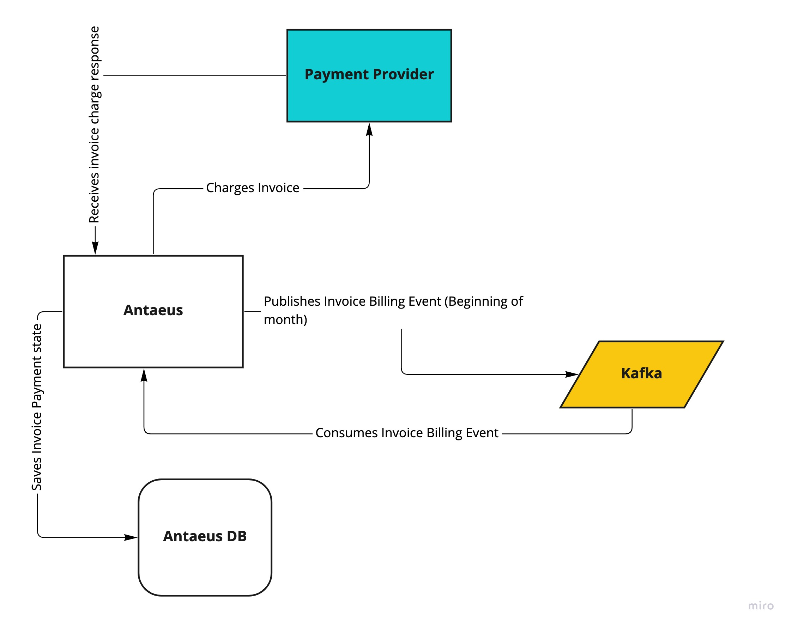

## Antaeus

Antaeus (/ænˈtiːəs/), in Greek mythology, a giant of Libya, the son of the sea god Poseidon and the Earth goddess Gaia. He compelled all strangers who were passing through the country to wrestle with him. Whenever Antaeus touched the Earth (his mother), his strength was renewed, so that even if thrown to the ground, he was invincible. Heracles, in combat with him, discovered the source of his strength and, lifting him up from Earth, crushed him to death.

Welcome to our challenge.

## The challenge

As most "Software as a Service" (SaaS) companies, Pleo needs to charge a subscription fee every month. Our database contains a few invoices for the different markets in which we operate. Your task is to build the logic that will schedule payment of those invoices on the first of the month. While this may seem simple, there is space for some decisions to be taken and you will be expected to justify them.

## Instructions

Fork this repo with your solution. Ideally, we'd like to see your progression through commits, and don't forget to update the README.md to explain your thought process.

Please let us know how long the challenge takes you. We're not looking for how speedy or lengthy you are. It's just really to give us a clearer idea of what you've produced in the time you decided to take. Feel free to go as big or as small as you want.

## Developing

Requirements:
- \>= Java 11 environment

Open the project using your favorite text editor. If you are using IntelliJ, you can open the `build.gradle.kts` file and it is gonna setup the project in the IDE for you.

### Building

```
./gradlew build
```

### Running

There are 2 options for running Anteus. You either need libsqlite3 or docker. Docker is easier but requires some docker knowledge. We do recommend docker though.

*Running Natively*

Native java with sqlite (requires libsqlite3):

If you use homebrew on MacOS `brew install sqlite`.

```
./gradlew run
```

*Running through docker*

Install docker for your platform

```
docker build . -t antaeus
docker run antaeus
```

### App Structure
The code given is structured as follows. Feel free however to modify the structure to fit your needs.
```
├── buildSrc
|  | gradle build scripts and project wide dependency declarations
|  └ src/main/kotlin/utils.kt 
|      Dependencies
|
├── pleo-antaeus-app
|       main() & initialization
|
├── pleo-antaeus-core
|       This is probably where you will introduce most of your new code.
|       Pay attention to the PaymentProvider and BillingService class.
|
├── pleo-antaeus-data
|       Module interfacing with the database. Contains the database 
|       models, mappings and access layer.
|
├── pleo-antaeus-models
|       Definition of the Internal and API models used throughout the
|       application.
|
└── pleo-antaeus-rest
        Entry point for HTTP REST API. This is where the routes are defined.
```

### Main Libraries and dependencies
* [Exposed](https://github.com/JetBrains/Exposed) - DSL for type-safe SQL
* [Javalin](https://javalin.io/) - Simple web framework (for REST)
* [kotlin-logging](https://github.com/MicroUtils/kotlin-logging) - Simple logging framework for Kotlin
* [JUnit 5](https://junit.org/junit5/) - Testing framework
* [Mockk](https://mockk.io/) - Mocking library
* [Sqlite3](https://sqlite.org/index.html) - Database storage engine

Happy hacking 😁!

# Solution

## System Architecture



The high level architecture overview is as follows
* `BillInvoiceJob` Scheduler executes and publishes (at the first of every month) Invoice Billing Event to Kafka (For Invoice with PENDING status)
  * Scheduler updates the Invoice status for successful publishing to PROCESSING (to avoid republishing same twice)
* Invoice Billing Event is consumed and Invoice is charged. If successful, the invoice status is updated to PAID and paidAt column is populated.

If Invoice charge fails with either 
  * `CurrencyMismatchException`, `InsufficientBalanceException`, an Admin is notified, a `FailedInvoicePayment` entry is created and is scheduled for retry
  * `CustomerNotFoundException`, an Admin is notified, a `FailedInvoicePayment` entry is created and is not scheduled for retry.
* `FailedInvoicePaymentJob` Scheduler executes at a configurable interval, and charges the invoice. If successful, 
InvoiceStatus is changed to PAID, paidAt is populated and `FailedInvoicePayment` is removed.
  * If the invoice charge fails, it is re-scheduled using some exponential backoff with a configurable **MAX_RETRY** count


### Running

To run the submission, execute the commands below in order.
The command below would start up the Kafka container, kowl(for visiualising events sent to kafka which can be accessed
at `localhost:8080`) and Zookeper using docker compose

```
docker compose up -d
```

Then run Anataeus Natively with sqlite (requires libsqlite3):

If you use homebrew on MacOS `brew install sqlite`.
```
./gradlew run
```

It is also possible to also run Anataeus as a container along with the Kafka infrastructure, but I had some
gradle-deamon issues and didn't want to spend much time, getting it to work.

To stop docker containers, run

```
docker compose down
```
    
### Distributed System Considerations

#### Kafka
Event driven was used to de-couple to domain. Kafka was chosen to enable distributed processing of invoice charge. i:e 
With multiple instances of Antaeus belonging to the same consumer group and an instance consuming from a partition, Kafka ensures a message
is sent to only one consumer.


#### Distributed Scheduler lock
`BillInvoiceJob` which publishes event to kafka and `FailedInvoicePaymentJob` which schedules retries of failed invoice charge
should execute only on one Anataeus instance at a time. 

I provided a **dummy implementation** of the distributed scheduler lock (`LockProvider`) because I couldn't find a library to 
do this. i:e Something like [Shedlock](https://github.com/lukas-krecan/ShedLock) for Spring, and I didn't want to expand the scope of the challenge. I 
would implement it if I had more time.

#### Testing
I have provided unit and Integration test for the submission. The Integration test starts up docker container using
`TestContainers` and stops them after the tests.

I used **postgresQl** docker container for database because it was easier to setup than **SQlite**

to run the test, 
```
./gradlew test
```

### Time taken
I would say that I spent ~ 22 hours on the challenge. Most of my time was spent setting up the local development and testing infrastructure
using docker-compose and Testcontainers respectively

In all, it was an interesting challenge ;)

### Other Libraries and dependencies
* [Test-containers](https://www.testcontainers.org/) - For running Integration test in docker containers
* [Awaitility](https://github.com/awaitility/awaitility) -  For Asynchronous testing expectation
* [Kafka-clients](https://github.com/apache/kafka) - Interacting (publish & consuming) from kafka
